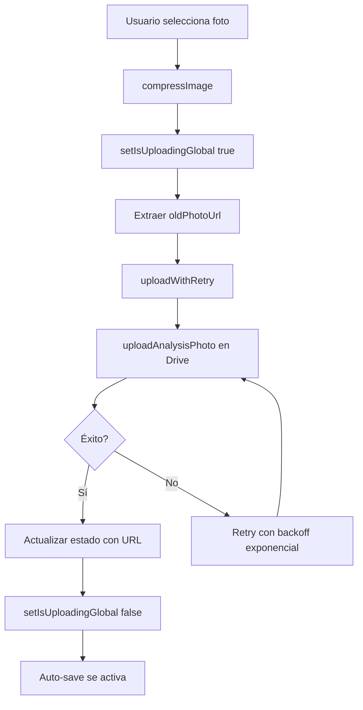
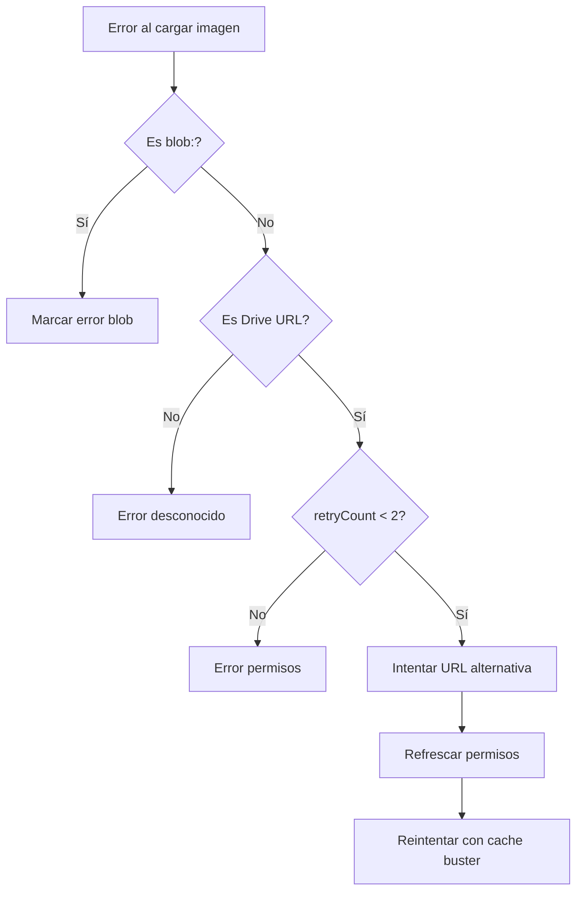

# Análisis Completo: Lógica de Fotos

## Resumen Ejecutivo
✅ **Estado General**: Correcta y robusta
⚠️ **Optimizaciones Identificadas**: 3 mejoras menores recomendadas

---

## 1. Subida de Fotos ✅

### Implementación Actual
**Ubicación**: [`PageContent.tsx`](file:///c:/Users/jarroyo/Analisis_Descongelado-main/app/dashboard/tests/new/PageContent.tsx)

#### Handlers Implementados
1. **`handlePhotoCapture`** (L481-585): Fotos genéricas (peso bruto, peso congelado, peso neto, uniformidad, foto calidad)
2. **`handleGlobalPesoBrutoPhoto`** (L702-737): Peso bruto global (códigos Dual Bag)
3. **`handlePesoBrutoPhotoCapture`** (L597-647): Pesos brutos individuales

### Flujo de Subida


### ✅ Fortalezas
- **Retry automático**: 3 intentos con exponential backoff
- **Compresión**: Todas las fotos se comprimen antes de subir
- **Race condition prevención**: `isUploadingGlobal` bloquea auto-save
- **Limpieza automática**: `oldPhotoUrl` se pasa correctamente
- **Consistencia**: Mismo patrón en todos los handlers

### ⚠️ Oportunidad de Mejora #1
**Problema**: Los handlers tienen código duplicado

**Recomendación**: Crear helper genérico
```typescript
const createPhotoUploadHandler = (
  photoTypeGetter: (index: number) => string,
  stateUpdater: (index: number, url: string) => void,
  oldUrlGetter?: (index: number) => string | undefined
) => async (file: File, analysisIndex?: number) => {
  // ... lógica común
};
```

**Impacto**: Código más mantenible, menor riesgo de inconsistencias

---

## 2. Borrado/Eliminación de Fotos ✅

### Borrado Individual (Reemplazo)
**Ubicación**: [`googleDriveService.ts:uploadAnalysisPhoto`](file:///c:/Users/jarroyo/Analisis_Descongelado-main/lib/googleDriveService.ts#L595-L608)

```typescript
if (oldPhotoUrl) {
  const oldFileId = this.extractFileIdFromUrl(oldPhotoUrl);
  if (oldFileId) {
    await this.deleteFile(oldFileId); // ✅ Elimina foto anterior
  }
}
```

### Eliminación Masiva (Análisis completo)
**Ubicación**: [`analysisService.ts:deleteAnalysis`](file:///c:/Users/jarroyo/Analisis_Descongelado-main/lib/analysisService.ts#L353-L390)

```typescript
const analysis = await getAnalysisById(analysisId);
if (analysis?.codigo && analysis?.lote) {
  await googleDriveService.deleteAnalysisFolder(codigo, lote); // ✅ Borra carpeta
}
await deleteDoc(analysisRef); // ✅ Borra de Firestore
```

### ✅ Fortalezas
- **Borrado sincronizado**: Drive + Firestore
- **Extracción robusta**: Soporta `x-file-id` y `id` estándar
- **Manejo de errores**: Continúa aunque falle borrado (no interrumpe flujo)

### ⚠️ Oportunidad de Mejora #2
**Problema**: Si varios análisis comparten el mismo `codigo + lote`, borrar uno elimina fotos de todos

**Contexto**: En la implementación actual, cada análisis debería tener un `lote` único. Pero si el usuario reutiliza valores...

**Recomendación**: Modificar estructura de carpetas para incluir ID único:
```
descongelado/
  └── CODIGO/
      └── LOTE_ANALYSISID/  ← Agregar ID para unicidad
          └── fotos...
```

**Impacto**: Previene pérdida accidental de datos. ⚡ **BAJA PRIORIDAD** (requiere migración de datos existentes)

---

## 3. Visualización de Fotos ✅

### Componente Principal
**Ubicación**: [`PhotoCapture.tsx`](file:///c:/Users/jarroyo/Analisis_Descongelado-main/components/PhotoCapture.tsx)

### Características Implementadas
1. **Preview local inmediato**: Blob URL (L121-122)
2. **Lazy loading**: Solo carga cuando hay URL
3. **Retry inteligente**: Hasta 2 reintentos con estrategias múltiples
4. **Timeout adaptativo**: 30s (4G), 45s (3G), 60s (2G)
5. **URL alternativas**: Fallback a descarga directa
6. **Refresco de permisos**: Si falla, intenta `makeFilePublic`

### Flujo de Recuperación


### ✅ Fortalezas
- **Soporte `x-file-id`**: Recientemente agregado ✨
- **UX optimizada**: Loading states, spinners, mensajes claros
- **Resiliencia**: Múltiples estrategias de recuperación
- **Detección de conexión**: Ajuste dinámico de timeouts

### ⚠️ Oportunidad de Mejora #3
**Problema**: Comentario duplicado en L29-30

**Código Actual**:
```typescript
// Función para generar URLs alternativas de Google Drive
// Función para generar URLs alternativas de Google Drive  ← Duplicado
const getAlternativeDriveUrl = ...
```

**Recomendación**: Eliminar línea duplicada

**Impact**: Cosmético, limpieza de código

---

## 4. Gestión de Estado ✅

### Estados Clave
| Estado | Propósito | Ubicación |
|--------|-----------|-----------|
| `uploadingPhotos` | Track individual uploads | PageContent.tsx:171 |
| `isUploadingGlobal` | Bloquear auto-save | PageContent.tsx:172 |
| `photos` | Archivos en tránsito | PageContent.tsx:170 |
| `localPreviewUrl` | Preview blob | PhotoCapture.tsx:24 |

### Race Condition Prevention
```typescript
// ✅ CORRECTO: Auto-save bloqueado durante upload
useEffect(() => {
  if (basicsCompleted && analysisId && !isUploadingGlobal) {
    const timer = setTimeout(() => saveDocument(), 1000);
    return () => clearTimeout(timer);
  }
}, [analyses, basicsCompleted, isUploadingGlobal]); // L441-449
```

---

## 5. Posibles Errores Identificados

### 🟢 Ningún Error Crítico
Tras revisión exhaustiva, **no se encontraron bugs críticos**.

### 🟡 Consideraciones Menores

#### A. Limpieza de Blob URLs
**Estado**: ✅ **Implementado correctamente**
```typescript
// PhotoCapture.tsx:67-73
useEffect(() => {
  return () => {
    if (localPreviewUrl) URL.revokeObjectURL(localPreviewUrl); // ✅ Cleanup
  };
}, [localPreviewUrl]);
```

#### B. Validación de Blob URLs en Save
**Estado**: ✅ **Implementado correctamente**
```typescript
// googleDriveService.ts:45-48
if (typeof data === 'string' && data.startsWith('blob:')) {
  throw new Error('No se puede guardar... URL blob detectada'); // ✅ Previene errores
}
```

---

## 6. Optimizaciones Propuestas

### Prioridad Alta
Ninguna requerida. Sistema funcional y robusto.

### Prioridad Media
1. **Refactorización de handlers** (Mejora #1)
   - Esfuerzo: 2-3 horas
   - Beneficio: Mantenibilidad

### Prioridad Baja
2. **Unicidad de carpetas** (Mejora #2)
   - Esfuerzo: 4-6 horas + migración
   - Beneficio: Prevención de edge cases

3. **Limpieza cosmética** (Mejora #3)
   - Esfuerzo: 1 minuto
   - Beneficio: Código más limpio

---

## Conclusión

### Estado Actual
✅ **Muy Bueno** - Sistema robusto y completo

### Cambios Recientes Exitosos
1. ✅ Implementación de `x-file-id` en URLs
2. ✅ Borrado automático de fotos antiguas
3. ✅ Eliminación de carpetas en Drive al borrar análisis
4. ✅ Retry automático con exponential backoff
5. ✅ Prevención de race conditions
6. ✅ Timeout adaptativo según conexión

### Recomendación Final
**No se requieren cambios urgentes**. Las optimizaciones propuestas son opcionales y pueden implementarse gradualmente según disponibilidad.

El sistema actual cumple con:
- ✅ Subir fotos correctamente
- ✅ Borrar fotos antiguas al reemplazar
- ✅ Eliminar carpetas al borrar análisis
- ✅ Visualizar fotos con recuperación automática
- ✅ Prevenir pérdida de datos
